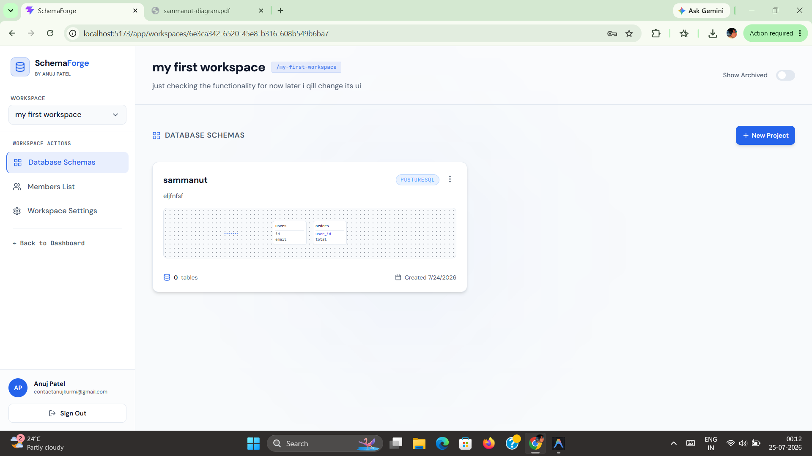
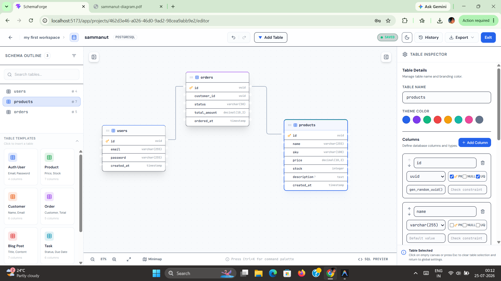
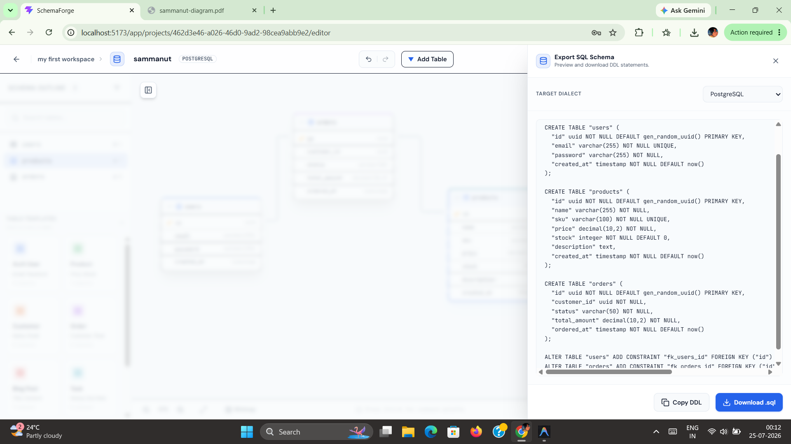

# SchemaForge

SchemaForge is a premium collaborative visual database schema designer, validator, and generation tool. It enables developers and teams to visually design database schemas, automatically validate relations, generate migrations, maintain history version snapshots, and export schemas to DBML, SQL, and other database dialects.

SchemaForge is designed to run as a high-performance SaaS platform.

## 📸 Screenshots

| Workspace Dashboard | Visual Schema Editor |
| --- | --- |
|  |  |

| SQL Export Preview |
| --- |
|  |


## 🚀 Key Features

- **Visual Database Modeler**: Interactive canvas built with React Flow (XYFlow) for visual table creation, relationship mapping, and database diagramming.
- **Dual-Representation Sync**: Real-time synchronization between visual design canvas state and schema definitions.
- **Collaborative Workspaces**: Multi-tenant workspace management allowing team collaboration with granular role-based permissions (`owner`, `admin`, `editor`, `viewer`, `commenter`).
- **Workspace Invitations**: Secure email invitation flow with token-based acceptance.
- **Schema Snapshots & Versioning**: Complete database schema versioning with labeled snapshots to track history and changes.
- **Robust Authentication**: Dual-token JWT rotation scheme using short-lived Access Tokens and secure `httpOnly` Refresh Tokens with Redis-backed blacklist rotation.
- **Performance & Security**: Rate limiting via Redis/memory, strict CORS settings, secure headers via Helmet, and structured API error handling.

---

## 🛠️ Architecture & Tech Stack

SchemaForge is organized as a monorepo utilizing **npm workspaces**:

```
SchemaForge/
├── backend/            # Node.js + Express API service
│   ├── prisma/         # Prisma schemas, DBML generator, migrations
│   └── src/            # Express source files (auth, workspaces, projects)
├── frontend/           # React + TypeScript client (Vite, Tailwind CSS, Framer Motion)
├── packages/           # Shared utilities and types
├── docker-compose.yml  # Docker environment for databases (PostgreSQL, Redis)
└── package.json        # Monorepo workspaces definition
```

### Stack Details
- **Monorepo Manager**: npm Workspaces
- **Backend**: Node.js 20, TypeScript 5, Express 4, Prisma ORM, Zod, Bcrypt
- **Frontend**: React 18, Vite 6, TypeScript 5, Tailwind CSS 4, Framer Motion, Tanstack Query, Zustand, XYFlow (React Flow)
- **Database & Cache**: PostgreSQL 16, Redis 7 (via Docker Compose)

---

## 🏃 Getting Started (Local Development)

### Prerequisites
- Node.js (v20 or higher)
- npm (v10 or higher)
- Docker & Docker Compose (for Postgres and Redis databases)

### Setup Steps

1. **Clone the repository**:
   ```bash
   git clone https://github.com/anujbijoria2020/SchemaForge.git
   cd SchemaForge
   ```

2. **Configure Environment Variables**:
   Both backend and frontend require `.env` configurations.
   
   - **Root/Backend Environment**:
     Copy `.env.example` in `backend/` to `.env`:
     ```bash
     cp backend/.env.example backend/.env
     ```
     Adjust database credentials and security secrets.
   
   - **Frontend Environment**:
     Create `.env` in `frontend/` containing standard API variables (e.g. `VITE_API_URL=http://localhost:4000/api`).

3. **Start Development Databases**:
   Ensure Docker is running and spin up the database containers:
   ```bash
   docker compose up -d
   ```

4. **Install Dependencies**:
   Install monorepo dependencies from the root directory:
   ```bash
   npm install
   ```

5. **Run Migrations & Seed Data**:
   Navigate to backend, generate Prisma client, run migrations, and seed initial database state:
   ```bash
   cd backend
   npx prisma generate
   npx prisma migrate dev
   npx prisma db seed
   cd ..
   ```

6. **Start Local Development Servers**:
   You can run backend and frontend concurrently using monorepo scripts from the root:
   - Start backend: `npm run dev:backend`
   - Start frontend: `npm run dev:frontend`

---

## 🛣️ API Endpoints Summary

All backend API requests are prefixed with `/api`. Authenticated requests require the `Authorization: Bearer <accessToken>` header.

### 🔐 Authentication (`/api/auth`)
- `POST /api/auth/register` - Create user profile
- `POST /api/auth/login` - Authenticate & generate JWT tokens
- `POST /api/auth/refresh` - Rotate tokens using secure cookie
- `POST /api/auth/logout` - Revoke tokens and destroy session
- `GET /api/auth/me` - Fetch profile of active user

### 🏢 Workspace Management (`/api/workspaces`)
- `POST /api/workspaces` - Create a workspace
- `GET /api/workspaces` - Get user's workspaces
- `GET /api/workspaces/:id` - Fetch workspace details
- `PATCH /api/workspaces/:id` - Edit workspace metadata
- `DELETE /api/workspaces/:id` - Remove workspace
- `GET /api/workspaces/:workspaceId/members` - List workspace members
- `POST /api/workspaces/:workspaceId/members` - Add member to workspace
- `PATCH /api/workspaces/:workspaceId/members/:userId` - Update member role
- `DELETE /api/workspaces/:workspaceId/members/:userId` - Revoke member access

### 📁 Project & Schema Management (`/api`)
- `POST /api/workspaces/:workspaceId/projects` - Create a project
- `GET /api/workspaces/:workspaceId/projects` - List workspace projects
- `GET /api/projects/:id` - Retrieve project data & active schema
- `PATCH /api/projects/:id` - Edit project metadata
- `DELETE /api/projects/:id` - Remove project
- `POST /api/projects/:id/archive` - Archive project
- `POST /api/projects/:id/schema` - Save visual canvas tables and metadata

### 🕒 Schema Versioning (`/api/projects/:id/versions`)
- `POST /api/projects/:id/versions` - Manual database schema snapshot
- `GET /api/projects/:id/versions` - List snapshots
- `GET /api/projects/:id/versions/:versionId` - Retrieve snapshot details

---

## 🏗️ Monorepo Commands
- Start dev backend: `npm run dev:backend`
- Start dev frontend: `npm run dev:frontend`
- Backend typecheck: `cd backend && npm run type-check`
- Frontend build: `cd frontend && npm run build`

---

## 🛡️ License & Copyright
Not for redistribution without express written consent.
